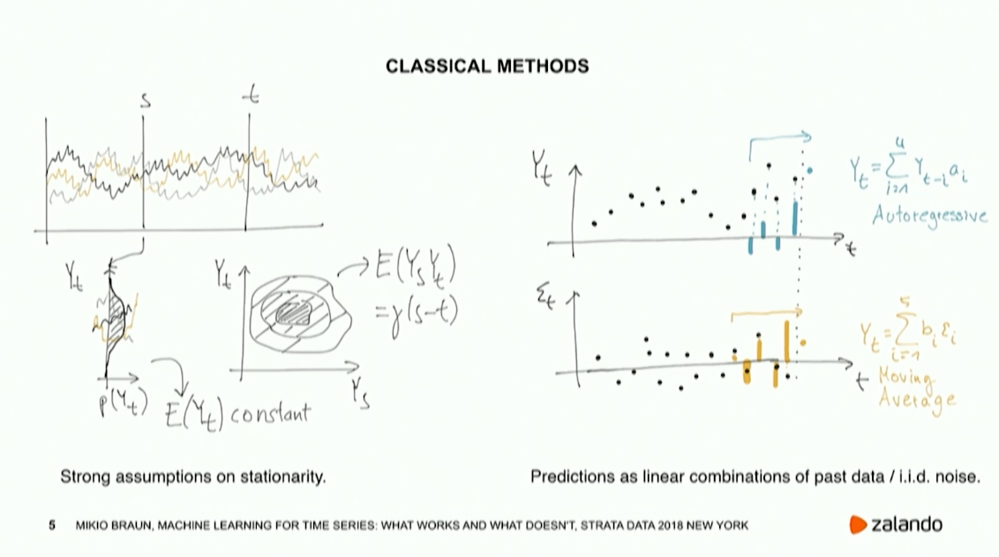
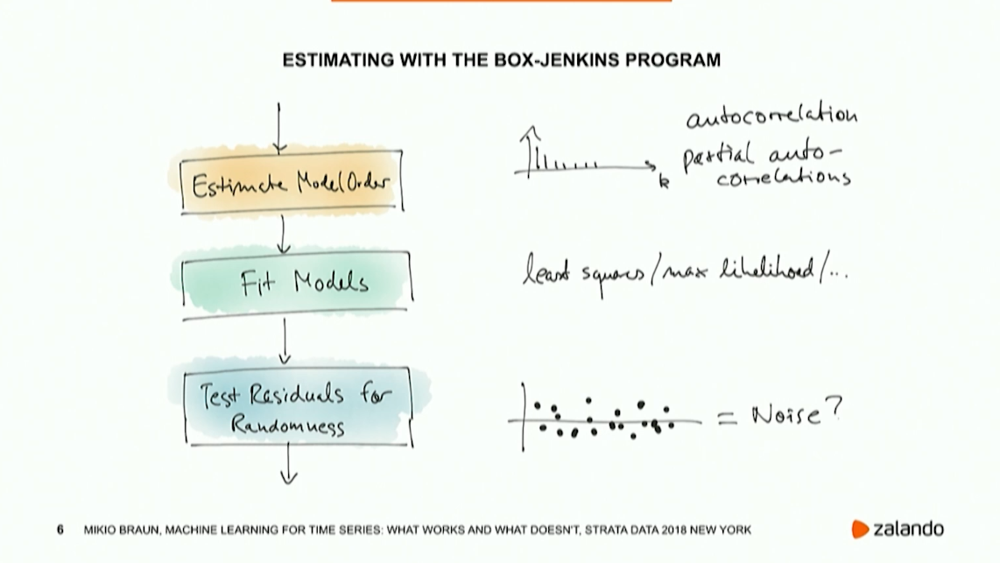

# Time Series

## Applications
Use prediction to detect anomalies. 

Classify periods of time to predict another variable (?) 

## Approaches
Classical Autoregressive models
Bayesian AR models
General ML approach
Deep Learning

### Classicial Autoregressive models
* Strong assumptions on stationarity, predictions as linear combinations of past data
* Two models
	- Autoregressive models
	- Moving average

Solid theoretical background. Very explicit modeling. A lot of control as it is a manual process.
Bayesian version available to provide uncertainty estimates.

#### Challenges
**Seasonality**: data is seldom stationary in reality, it shows cycles/seasons/trends. In the 
classicial approach, these are manually removed first (decomposed

### General ML
Transform it into a supervised learning problem.

### Deep learning
Does a lot of the feature generation for you.

